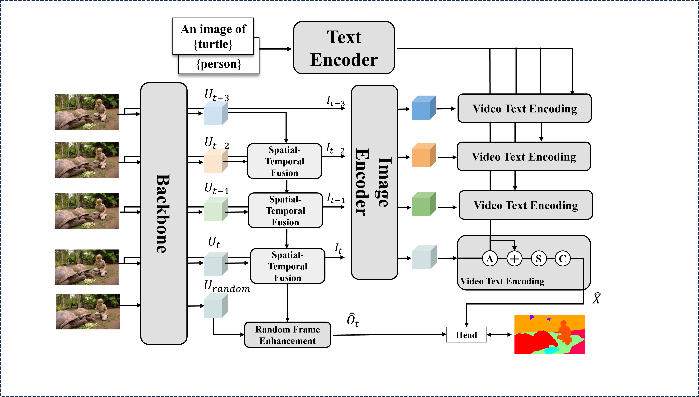

# OV2VSS
Official PyTorch implementation of Towards Open-Vocabulary Video Semantic Segmentation

## Abstract
Semantic segmentation in videos has been a focal point of recent research. However, existing models encounter challenges when faced with unfamiliar categories. To address this, we introduce the Open Vocabulary Video Semantic Segmentation (OV-VSS) task, designed to accurately segment every pixel across a wide range of open-vocabulary categories, including those that are novel or previously unexplored. To enhance OV-VSS performance, we propose a robust baseline, OV2VSS, which integrates a spatial-temporal fusion module, allowing the model to utilize temporal relationships across consecutive frames. Additionally, we incorporate a random frame enhancement module, broadening the model’s understanding of semantic context throughout the entire video sequence. Our approach also includes video text encoding, which strengthens the model's capability to interpret textual information within the video context.
Comprehensive evaluations on benchmark datasets such as VSPW and Cityscapes highlight OV-VSS’s zero-shot generalization capabilities, especially in handling novel categories. The results validate OV2VSS's effectiveness, demonstrating improved performance in semantic segmentation tasks across diverse video datasets.



Authors: [Xinhao Li](), [Yun Liu](https://yun-liu.github.io/), [Guolei Sun](https://scholar.google.com/citations?hl=zh-CN&user=qd8Blw0AAAAJ), [Min Wu](https://scholar.google.com/citations?user=Hji1uWQAAAAJ&hl=zh-CN), [Le Zhang](https://zhangleuestc.github.io), [Ce Zhu](http://www.avc2-lab.net/~eczhu/).

## Note
This is a preliminary version for early access and I will clean it for better readability.

## Installation
Please follow the guidelines in [MMSegmentation v0.13.0](https://github.com/open-mmlab/mmsegmentation/tree/v0.13.0).

Other requirements:
```timm==0.3.0, CUDA11.1, pytorch==1.9.0, torchvision==0.8.2, mmcv==1.3.9```


## Usage
### Data preparation
Please follow [VSPW](https://github.com/sssdddwww2/vspw_dataset_download) to download VSPW 480P dataset.
After correctly downloading, the file system is as follows:
```
vspw-480
├── video1
    ├── origin
        ├── .jpg
    └── mask
        └── .png
```
The dataset should be put in ```/data/vspw/```. Or you can use Symlink: 
```
mkdir -p data/vspw/
ln -s /dataset_path/VSPW_480p data/vspw/
```

Split and mask data: (note that the path should be changed according to your own)
```
python mmseg/handle_data/prepare_vspw_seen.py
python mmseg/handle_data/prepare_vspw_unseen.py
python mmseg/handle_data/prepare_vspw_val.py
```

### Training
Training only requires 1 Nvidia GPUs, which has > 20G GPU memory.
```
# Multi-gpu training
./tools/dist_train.sh local_configs/vit/vitb/vitb.py 1 --work-dir model_path/vspw2/work_dirs_4g_b1
```

### Test
1. Download the trained weights from [here]().
2. Run the following commands:
```
# Multi-gpu testing
./tools/dist_test.sh local_configs/vit/vitb/vitb.py /path/to/checkpoint_file <GPU_NUM> \
--out /path/to/save_results/res.pkl
```

## License
This project is only for academic use. For other purposes, please contact us.

## Acknowledgement
The code is heavily based on the following repositories:
- https://github.com/open-mmlab/mmsegmentation
- https://github.com/NVlabs/SegFormer
- https://github.com/GuoleiSun/VSS-MRCFA

Thanks for their amazing works.

## Citation
```
@article{li2024towards,
  title={Towards Open-Vocabulary Video Semantic Segmentation},
  author={Li, Xinhao and Liu, Yun and Sun, Guolei and Wu, Min and Zhang, Le and Zhu, Ce},
  journal={arXiv preprint arXiv:2412.09329},
  year={2024}
}
```

## Contact
- Xinhao Li, oliverfuus@gmail.com
- Le Zhang, 
